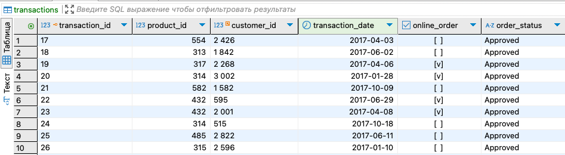

# Проектирование и реализация базы данных

## Задание
Разработать структуру базы данных для хранения информации о клиентах и их транзакциях.  
Исходные данные - customer_and_transaction.xlsx.

### Задачи:
1. Продумать структуру базы данных и отрисовать её в виде диаграммы.
2. Нормализовать базу данных (1НФ — 3НФ) и описать процесс.
3. Создать таблицы в PostgreSQL.
4. Загрузить данные и приложить скриншоты успешного выполнения.

---

## **1. Структура базы данных**

### Диаграмма базы данных


Изображение диаграммы в https://dbdiagram.io/

### Код диаграммы:
```dbml
Table customers {
   customer_id serial [pk]
   first_name varchar(50)
   last_name varchar(50)
   gender varchar(10)
   DOB date
}

Table customer_wealth {
   id serial [pk]
   customer_id integer [ref: > customers.customer_id]
   job_title varchar(100)
   job_industry_category varchar(100)
   wealth_segment varchar(50)
   deceased_indicator char(1)
   owns_car varchar(3)
}

Table customer_property {
   id serial [pk]
   customer_id integer [ref: > customers.customer_id]
   address varchar(255)
   postcode varchar(20)
   state varchar(100)
   country varchar(100)
   property_valuation integer
}

Table transactions {
   transaction_id serial [pk]
   product_id integer [ref: > products.product_id]
   customer_id integer [ref: > customers.customer_id]
   transaction_date date
   online_order boolean
   order_status varchar(50)
}

Table products {
   product_id serial [pk]
   brand varchar(100)
   product_line varchar(100)
   product_class varchar(50)
   product_size varchar(50)
   list_price decimal(10, 2)
   standard_cost decimal(10, 2)
}
```
## **2. Нормализации базы данных (1НФ — 3НФ)**

### 1НФ (первая нормальная форма)

Условия:
- У строк должно быть уникальное значение первичного ключа.
- Данные должны быть атомарными (в одной ячейке - одно значение).
- Без повторяющихся столбцов.

Проблема в исходнике: в одной строке хранились разнородные данные (информация о пользователе, его работе, его географии и покупках).

Решение: данные поделены на отдельные таблицы:
- customers — информация о клиенте,
- customer_wealth — работа и доход клиента,
- customer_property — недвижимость клиента,
- transactions — покупки клиента,
- products — информация о товарах.

### 2НФ (вторая нормальная форма)

Условия:
- Таблицы уже приведены в 1НФ.
- Каждый столбец должен зависеть от всей записи (первичного ключа).

Проблема в исходнике:
- Поля job_title, wealth_segment, job_industry_category, owns_car зависят от клиента, а не от первичного ключа transaction_id.
- Поля brand, product_line, product_class зависят от продукта, а не от transaction_id.

Решение: все повторяющиеся атрибуты вынесены в отдельные таблицы:
- customer_wealth — теперь связана с клиентом, а не с транзакциями.
- products — теперь связана с transactions, но сама хранит данные о товаре.

### 3НФ (третья нормальная форма)

Условия:
- Таблицы уже в форме 2НФ.
- Все неключевые атрибуты должны зависеть только от первичного ключа и не зависеть друг от друга.

Проблемы:
- job_industry_category → зависит от job_title, и оба поля были в customers.
- wealth_segment → зависит от уровня дохода, и был в customers.

Решение: эти данные вынесены в отдельные таблицы (customer_wealth).

## Итоговая нормализация

| Таблица              | Содержит                                                                          |
|---------------------|----------------------------------------------------------------------------------|
| `customers`        | customer_id, first_name, last_name, gender, DOB                                  |
| `customer_wealth`  | customer_id, job_title, job_industry_category, wealth_segment, deceased_indicator, owns_car |
| `customer_property` | customer_id, address, postcode, state, country, property_valuation             |
| `transactions`     | transaction_id, product_id, customer_id, transaction_date, online_order, order_status |
| `products`         | product_id, brand, product_line, product_class, product_size, list_price, standard_cost |

## **3. Создание таблиц в DBeaver с указание первичных ключей к таблицам, правильных типов данных (использовать команду CREATE TABLE)

Чтобы не нарушить структуру данных я решила сначала содать таблицы в исходном виде, а потом уже делить их на таблицы того вида и той структуры, которую запланировала в https://dbdiagram.io/

### Код SQL-запросов для создания таблиц в исходном виде:
```dbml
-- Создание таблицы customers
create table customers (
   customer_id serial primary key,
   first_name varchar(50),
   last_name varchar(50),
   gender varchar(10),
   DOB date,
   job_title varchar(100),
   job_industry_category varchar(100),
   wealth_segment varchar(50),
   deceased_indicator char(1),
   owns_car varchar(3),
   address varchar(255),
   postcode varchar(20),
   state varchar(100),
   country varchar(100),
   property_valuation integer
);

-- Загрузка данных в customers
copy customers (customer_id, first_name, last_name, gender, DOB, job_title, job_industry_category, wealth_segment, deceased_indicator, owns_car, address, postcode, state, country, property_valuation)
from '/tmp/customer.csv'
delimiter ','
csv header;

-- Проверка результата загрузки
select count(*) from customers;

-- Создание таблицы transactions
create table transactions (
   transaction_id serial primary key,
   product_id integer,
   customer_id integer references customers(customer_id),
   transaction_date date,
   online_order boolean,
   order_status varchar(50),
   brand varchar(100),
   product_line varchar(100),
   product_class varchar(50),
   product_size varchar(50),
   list_price decimal(10, 2),
   standard_cost decimal(10, 2),
   foreign key (customer_id) references customers(customer_id)
);

SELECT pg_ls_dir('/tmp');

SELECT pg_stat_file('/tmp/transaction.csv');

copy transactions (transaction_id, product_id, customer_id, transaction_date, online_order, order_status, brand, product_line, product_class, product_size, list_price, standard_cost)
from '/tmp/transactions.csv'
delimiter ','
csv header;

SELECT COUNT(*) FROM customers;
SELECT COUNT(*) FROM transactions;
```

### Создание новых таблиц
```dbml
-- Создание новой таблицы для данных о финансовом статусе клиентов
create table customer_wealth (
    id serial primary key,
    customer_id integer references customers(customer_id),
    job_title varchar(100),
    job_industry_category varchar(100),
    wealth_segment varchar(50),
    deceased_indicator char(1),
    owns_car varchar(3)
);

-- Таблица для данных о недвижимости клиентов
create table customer_property (
    id serial primary key,
    customer_id integer references customers(customer_id),
    address varchar(255),
    postcode varchar(20),
    state varchar(100),
    country varchar(100),
    property_valuation integer
);

-- Новая таблица с продуктами
create table products (
    product_id serial primary key,
    brand varchar(100),
    product_line varchar(100),
    product_class varchar(50),
    product_size varchar(50),
    list_price decimal(10, 2),
    standard_cost decimal(10, 2)
);
```

## 4. Загрузка данных и скриншоты успешного выполнения
### Перенос данных в новые таблицы
```dbml
-- Перенос данных в таблицу о достатке клиентов
insert into public.customer_wealth (customer_id, job_title, job_industry_category, wealth_segment, deceased_indicator, owns_car)
select customer_id, job_title, job_industry_category, wealth_segment, deceased_indicator, owns_car
from public.customers;

-- Перенос данных в отдельную новую таблицу о недвижимости
insert into public.customer_property (customer_id, address, postcode, state, country, property_valuation)
select customer_id, address, postcode, state, country, property_valuation
from public.customers;

-- Заполнение новой таблицы о продуктах
insert into public.products (brand, product_line, product_class, product_size, list_price, standard_cost)
select distinct brand, product_line, product_class, product_size, list_price, standard_cost
from public.transactions;
```

### Перенос данных и проверка
```dbml
-- Обновление данных в таблице transactions методом join, т.к. источник в другой таблице
update public.transactions t
set product_id = p.product_id
from public.products p
where t.brand = p.brand
  and t.product_line = p.product_line
  and t.product_class = p.product_class
  and t.product_size = p.product_size
  and t.list_price = p.list_price
  and t.standard_cost = p.standard_cost;

select count(*) from public.customer_wealth;
```
### Удаление из customers и transactions перенесенных в новые таблицы столбцов
```dbml
-- Удаление из customers перенесенных в новые таблицы столбцов
alter table customers drop column job_title;
alter table customers drop column job_industry_category;
alter table customers drop column wealth_segment;
alter table customers drop column deceased_indicator;
alter table customers drop column owns_car;
alter table customers drop column address;
alter table customers drop column postcode;
alter table customers drop column state;
alter table customers drop column country;
alter table customers drop column property_valuation;

-- Удаление из transactions перенесенных в новую таблицу столбцов
alter table transactions drop column brand;
alter table transactions drop column product_line;
alter table transactions drop column product_class;
alter table transactions drop column product_size;
alter table transactions drop column list_price;
alter table transactions drop column standard_cost;
```

### Cкриншоты успешного выполнения
customers — информация о клиенте


customer_wealth — работа и доход клиента


customer_property — недвижимость клиента


transactions — покупки клиента


products — информация о товарах. Тут с нулями что-то пошло не так...

